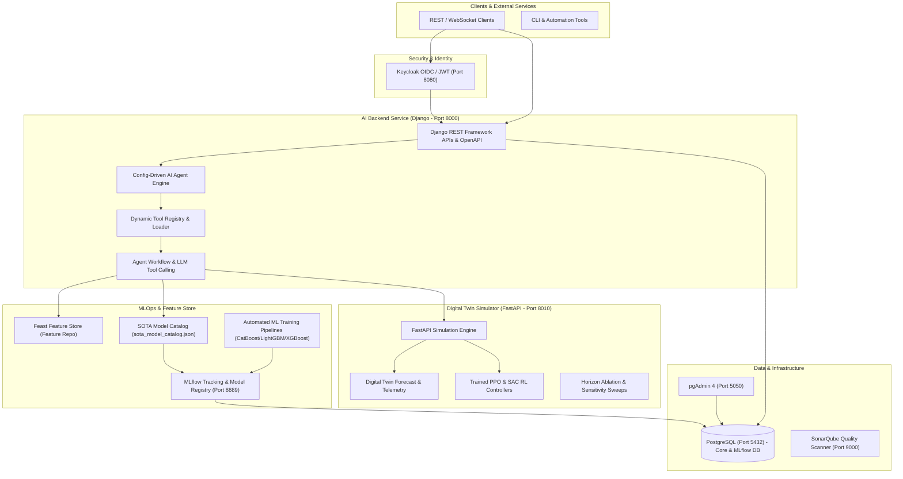

# PulseAI — Config-Driven AI Agent & MLOps Platform

[](https://www.python.org/downloads/release/python-3110/)
[](https://www.djangoproject.com/)
[](https://fastapi.tiangolo.com/)
[](https://mlflow.org/)
[](https://feast.dev/)

**PulseAI** is a general, config-driven, autonomous AI Agent & MLOps platform for dynamic blood donation management, supply orchestration, inventory optimization, and digital twin simulation.

---

## 🏛️ System Architecture



---

## 🚀 Key Features

1. **Config-Driven AI Agent Engine** (`backendMulti` & `AGENTS.md`):
   - Dynamic tool discovery driven entirely by configuration files (YAML/JSON), schemas, and permissions without hardcoding tool logic.
   - Intelligent tool selection and LLM agent orchestrator loop.
2. **Full MLOps Stack** (`ml-backend`):
   - **Feast Feature Store** (`ml-backend/feature_repo`): Offline/online feature definitions for blood registry and hospital supply features.
   - **MLflow Tracking Server & Model Registry** (Port 8889): Centralized tracking database backend and artifact store.
   - **Model Catalog & Automated Pipelines**: Production model catalog (`sota_model_catalog.json`) and automated training scripts for CatBoost, LightGBM, XGBoost, and PPO reinforcement learning agents.
3. **Digital Twin Simulation Engine** (`simulation_studio`):
   - FastAPI simulation microservice (Port 8010) generating realistic supply/demand dynamics.
   - Trained PPO controllers, horizon ablation sweeps, sensitivity analysis, and real-time digital twin forecasting.
4. **Containerized Production Infrastructure** (`infrastructure`):
   - Docker Compose setup orchestrating PostgreSQL (Port 5432), MLflow (Port 8889), Keycloak OIDC (Port 8080), pgAdmin (Port 5050), and SonarQube (Port 9000).

---

## 📋 Prerequisites

- **Docker & Docker Compose**
- **Python 3.11+** & `virtualenv`

---

## 🛠️ Quick Start

### 1. Initialize Environment & Dependencies
```bash
./run.sh setup
```
`setup` creates `.env.local` from `.env.example` if it does not exist, provisions a Python virtual environment, installs backend dependencies, and runs database migrations.

Fill `KEYCLOAK_CLIENT_SECRET` in `.env.local` before starting services. Find the secret in `infrastructure/config/keycloak-export/pios-realm.json` under `clientId: django-backend`.

### 2. Launch Docker Services & Backend
```bash
./run.sh start
```

### 3. Service Dashboard

| Service | Protocol | Access URL | Description |
| :--- | :--- | :--- | :--- |
| **Django AI Backend** | HTTP | `http://localhost:8000` | Core AI agent, prediction endpoints, REST API |
| **OpenAPI / Swagger Docs** | HTTP | `http://localhost:8000/api/docs/` | Interactive API documentation & auto-auth |
| **Simulation Studio** | HTTP / WS | `http://localhost:8010` | Digital Twin Simulation Engine API & WebSockets |
| **MLflow Server** | HTTP | `http://localhost:8889` | Model tracking server & artifact registry |
| **Keycloak OIDC** | HTTP | `http://localhost:8080` | Identity, OAuth2 & JWT token authentication |
| **pgAdmin 4** | HTTP | `http://localhost:5050` | Database management GUI for PostgreSQL |
| **SonarQube Scanner** | HTTP | `http://localhost:9000` | Static analysis & code quality scanner |
| **PostgreSQL** | TCP | `localhost:5432` | Core DB & MLflow tracking store |

---

## 🤖 Config-Driven Tool System (`AGENTS.md`)

In accordance with strict system architectural rules in `AGENTS.md`, **no tool logic, model names, API routes, or threshold values are hardcoded in application code**.

Every AI tool is dynamically configured:
```yaml
id: donor_eligibility_classifier
name: Donor Eligibility Classifier
type: model
enabled: true
description: Predicts whether a donor is eligible
input_schema:
  age: integer
  weight: number
  last_donation_date: string
output_schema:
  eligible: boolean
  reason: string
adapter: classification_model
entrypoint: models.eligibility.predict
permissions:
  - read_donor_profile
timeout_seconds: 10
```
The agent automatically discovers and registers tools at startup via config loaders.

---

## 🔬 MLOps & Feast Feature Store Workflow

### Feast Feature Store
Located in `ml-backend/feature_repo/`:
```bash
cd ml-backend/feature_repo
# Inspect feature store configuration
cat feature_store.yaml
# View defined feature entities and views
python feature_definitions.py
```

### MLflow Experiment Tracking
Access MLflow UI at `http://localhost:8889`. Experiment runs, hyperparameters, metrics, and registered models are persisted in PostgreSQL.

---

## 🧪 Testing & Verification

Run the full automated test suite for all backend modules:

```bash
# 1. Django Backend & AI Tool Registry Tests
cd backendMulti
pytest tests authApp workspace backendMulti bloodbag centres communications dashboard inventory ml notifications testUrl alerts

# 2. Simulation Studio & Digital Twin Tests
cd ../simulation_studio
pytest tests

# 3. MLOps & Training Schedule Smoke Tests
cd ..
python -m pytest ml-backend/tests/test_training_schedule_imports.py -q
```

