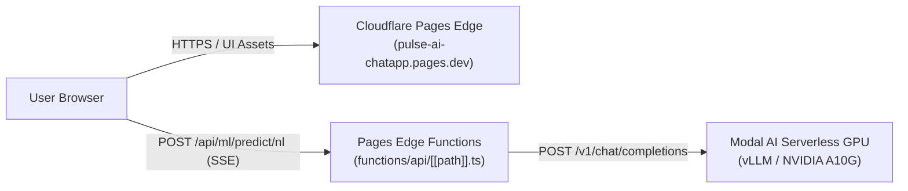

# Hosting the Frontend on Cloudflare Pages

This guide explains how to host and deploy the **PulseAI ChatApp frontend** (`chatapp/`) to **Cloudflare Pages**, including build settings, backend CORS configuration, environment variables, and automated CI/CD.

---

## 🏗️ Architecture Overview

The frontend can operate in two flexible architectures:

### Mode A: 100% Serverless Edge (Recommended — No Backend Hosting Required)
Cloudflare Pages hosts both the static frontend and serverless **Pages Functions** (`functions/api/[[path]].ts`). When a user sends a query, the edge function proxies directly to your **Modal AI GPU backend** (`vLLM`), streams tokens back to the browser via SSE, and formats real-time agent telemetry. Zero Django server or database hosting is required.



### Mode B: Dedicated Django / ML Backend
If you deploy the full Django backend (e.g., on Render, Railway, AWS, or local Cloudflare Tunnel), Cloudflare Pages serves the static UI assets and routes API requests to your external backend URL via `VITE_API_BASE_URL`.

---

## 🚀 Deployment Options

### Method 1: Cloudflare Dashboard (Recommended — Zero Maintenance)

1. Log in to the [Cloudflare Dashboard](https://dash.cloudflare.com/).
2. Navigate to **Workers & Pages** > **Create application** > **Pages** > **Connect to Git**.
3. Select your repository (`pulse-ai`) and click **Begin setup**.
4. Configure the **Build Settings**:
   - **Project Name**: `pulse-ai-chatapp`
   - **Production Branch**: `main`
   - **Framework Preset**: `Vite`
   - **Root Directory**: `chatapp`
   - **Build Command**: `npm run build`
   - **Build Output Directory**: `dist`
5. Configure **Environment Variables** (expand *Environment variables*):
   | Variable | Value | Required | Description |
   |---|---|---|---|
   | `MODAL_LLM_API_URL` | `https://yassinetakiko--pulseai-vllm-backend-serve.modal.run` | No (has default) | Modal AI vLLM backend URL |
   | `MODAL_LLM_MODEL` | `Qwen/Qwen2.5-7B-Instruct` | No (has default) | Model identifier served on Modal |
   | `MODAL_LLM_TIMEOUT_S` | `90.0` | No (has default) | Max inference / cold start timeout (seconds) |
   | `VITE_API_BASE_URL` | *(leave empty for serverless edge mode)* | No | Set only if using external Django backend |
   | `VITE_DEFAULT_MODEL`| `PulseAI Orchestrator (Modal GPU)` | No | Model label displayed in UI header |
6. Click **Save and Deploy**. Cloudflare will build and publish the application to `https://pulse-ai-chatapp.pages.dev`.

---

### Method 2: Cloudflare Wrangler CLI (Direct Command Line Deploy)

You can build and deploy directly from your local terminal or release scripts using Wrangler:

1. Log in to Cloudflare CLI:
   ```bash
   npx wrangler login
   ```
2. Navigate to the frontend directory:
   ```bash
   cd chatapp
   ```
3. Set your production API URL and build the assets:
   ```bash
   VITE_API_BASE_URL=https://api.yourdomain.com npm run build
   ```
4. Deploy to Cloudflare Pages:
   ```bash
   npm run pages:deploy
   # or:
   npx wrangler pages deploy dist --project-name=pulse-ai-chatapp
   ```

---

### Method 3: GitHub Actions Automated CI/CD

An automated workflow is provided at [`.github/workflows/cloudflare-pages.yml`](file:///Users/a1234/Documents/pulse-ai/.github/workflows/cloudflare-pages.yml).

To enable automated deployments on every `git push` to `main`:
1. In your GitHub repository, go to **Settings** > **Secrets and variables** > **Actions**.
2. Add the following repository secrets:
   - `CLOUDFLARE_API_TOKEN`: Cloudflare API Token with `Cloudflare Pages: Edit` permissions.
   - `CLOUDFLARE_ACCOUNT_ID`: Your Cloudflare Account ID (visible on Cloudflare dashboard URL or overview).
   - `VITE_API_BASE_URL`: URL of your backend (e.g. `https://api.pulse-ai.org`).
   - `VITE_WS_BASE_URL`: (Optional) WebSocket URL (e.g. `wss://api.pulse-ai.org`).
3. Pushes to `main` modifying `chatapp/**` will automatically build, test, and deploy to Cloudflare Pages.

---

## 🔒 Backend CORS & CSRF Configuration

Because Cloudflare Pages runs on a different domain (e.g. `https://<project>.pages.dev` or your custom domain), your Django backend must allow requests from the Pages origin.

In your backend `.env` file (e.g. on your server or container environment):

```env
# Allow specific Cloudflare Pages domain and custom domains
CORS_ALLOWED_ORIGINS=https://pulse-ai-chatapp.pages.dev,https://chat.pulse-ai.org,http://localhost:5173

# CSRF protection for authenticated mutations
CSRF_TRUSTED_ORIGINS=https://pulse-ai-chatapp.pages.dev,https://chat.pulse-ai.org,http://localhost:5173

# Allow all Cloudflare Pages preview deployment URLs (e.g. https://*.pulse-ai-chatapp.pages.dev)
CORS_ALLOWED_ORIGIN_REGEXES=^https://.*\.pages\.dev$
```

The Django configuration in [`backendMulti/settings.py`](file:///Users/a1234/Documents/pulse-ai/backendMulti/backendMulti/settings.py) dynamically parses these variables without hardcoding.

---

## 📁 Key Cloudflare Pages Files

The frontend includes dedicated configuration files for Cloudflare Pages:

- **[`chatapp/wrangler.toml`](file:///Users/a1234/Documents/pulse-ai/chatapp/wrangler.toml)**: Project metadata, compatibility date, and build output directory.
- **[`chatapp/public/_redirects`](file:///Users/a1234/Documents/pulse-ai/chatapp/public/_redirects)**: Handles SPA routing (`/* /index.html 200`) and optional proxying.
- **[`chatapp/public/_headers`](file:///Users/a1234/Documents/pulse-ai/chatapp/public/_headers)**: Security headers (`X-Frame-Options`, `X-Content-Type-Options`, `Referrer-Policy`).
- **[`chatapp/src/config/appConfig.ts`](file:///Users/a1234/Documents/pulse-ai/chatapp/src/config/appConfig.ts)**: Config-driven endpoint resolver that automatically adjusts relative vs absolute URLs.
- **[`chatapp/.env.example`](file:///Users/a1234/Documents/pulse-ai/chatapp/.env.example)**: Example environment file for frontend settings.

---

## 🧪 Verification & Testing

### Test Frontend Build & Configuration
```bash
cd chatapp
npm test          # Runs config resolver unit tests
npm run build     # Verifies TypeScript types and Vite production build
```

### Test Backend CORS Configuration
```bash
cd backendMulti
../.venv/bin/python manage.py test tests.test_cors_config
```
